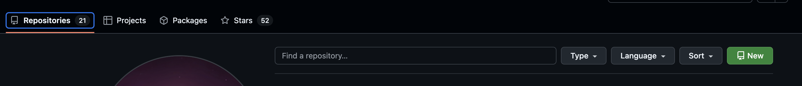
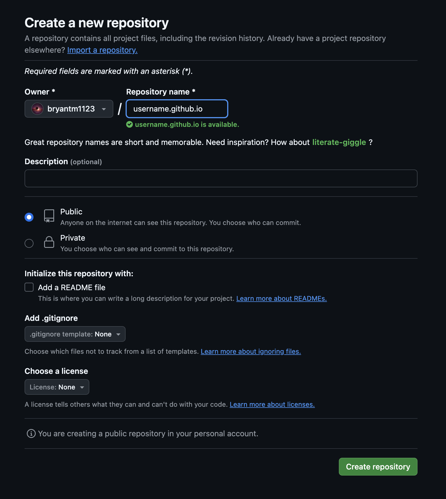
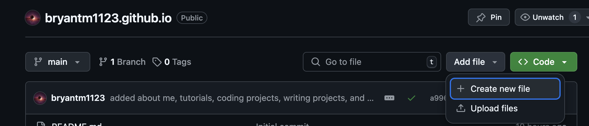
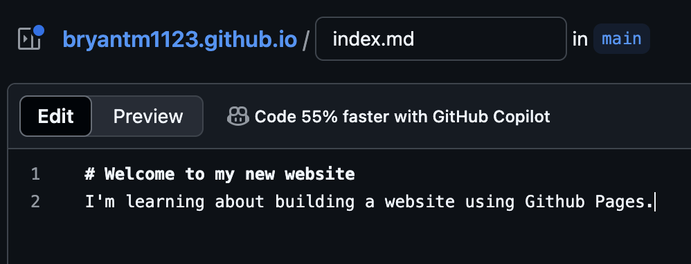
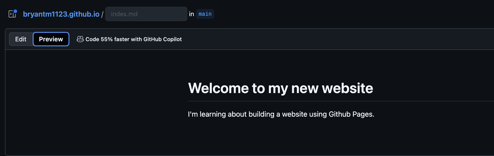
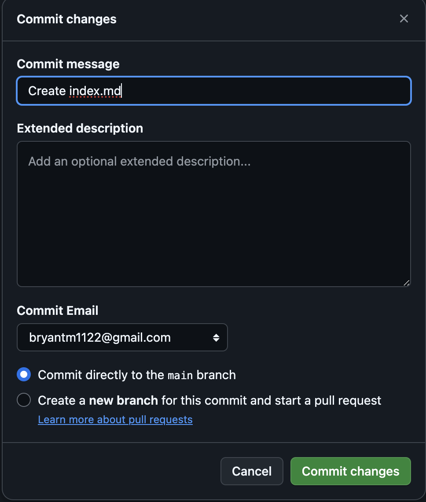
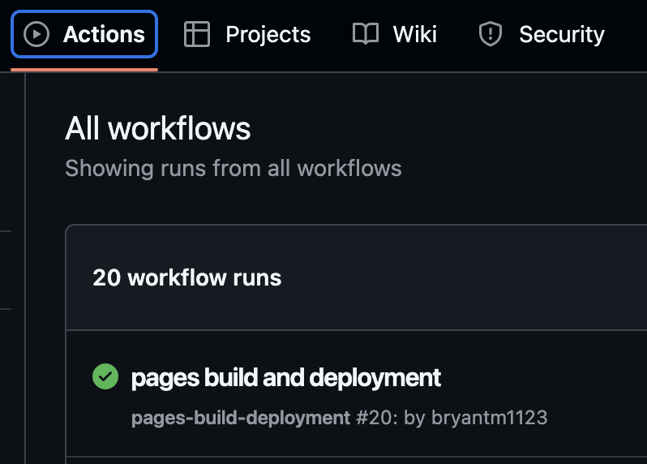
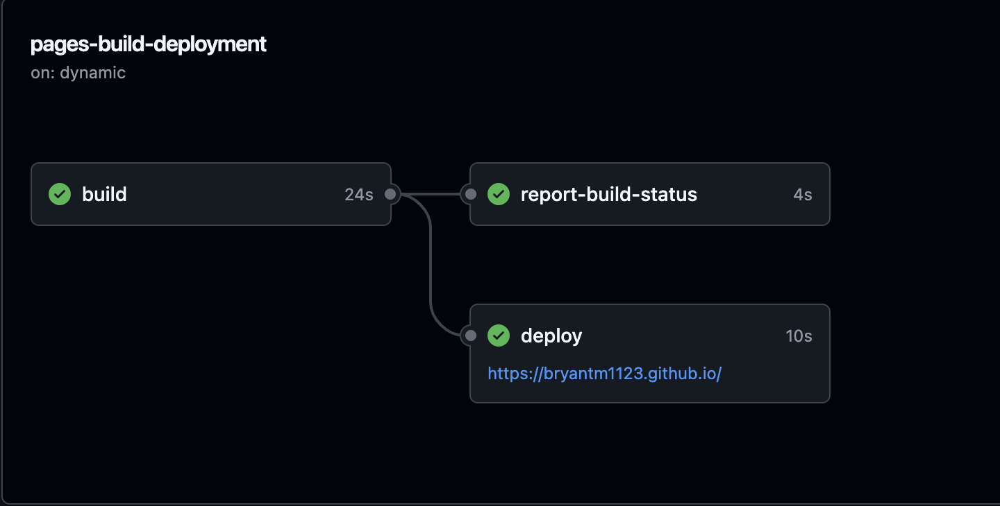

## Introduction
In this tutorial, we'll learn how to create a static website, with free hosting, courtesy of Github. All we'll need is a simple repository and a markdown file—no HTML, CSS, or code of any kind will be required.

## Create a Github repository
To get started, you'll need a [Github](https://github.com/) account. A free account will suffice for this tutorial.

Once you've logged in to your account, click on the **Repositories** tab, then click **New**:

You'll see a short form for filling in details about your new repository. In the **Repository name** field, enter `{your Github username}.github.io`. For example, my username is `bryantm1123`, so my repository name is `bryantm1123.github.io`.

The form also allows you to add a description for your repository, and to set its visibility on Github as either **Public** or **Private**—note that your website will be publicly visible on the internet, even if you set your repository's visibility to private.

There is also an option to add a **README** file—which I recommend. README files are traditional in software engineering and describe what a project does, and what setup steps are required in order to use it. They're often written in Markdown, which we'll use for the website we're building. So adding a README will provide another opportunity for practice!

## Add an index file
Now that we have a new repository setup, let's add an index file to serve as the landing page for our website. To do this: 
- Navigate to your repository.
- Click the **Code** tab. 
- Click **Add file**.
- Click **Create new file**.

Name the file `index.md` and using the **Edit** screen, add a header and description as shown below:

You can preview what the file will look like when rendered by clicking the **Preview** tab.

Commit your changes by clicking **Commit changes**. It's good practice to write a short commit message describing the changes you made. We'll also commit this directly to the `main` branch, which is the default version control branch for publishing updates to our website.

## Visit your new website
After commiting your changes, Github will automatically publish the latest version of your website. You can monitor this process by navigating to the **Actions** tab in your repository. Here you'll see a list of **Workflow runs**. Click the top entry in the list.

On the next screen, you'll see a graph showing the status of the build and deployment processes. When in progress, the indicators will be yellow. Upon completion, the indicators will be green with a checkmark.

Now your website is ready to view. You can either click the link on the  **deploy** box, or navigate in your web browser to the repository name you created [earlier](#create-a-github-repository), for example `{Your Github username}.github.io`—by default, this serves as the domain address for your website. You should now see your shiny new website, open to the landing page powered by the `index.md` file.

## Conclusion
In this tutorial, we learned how to create a static website by using **Github Pages**. A static website is a good choice for a site that displays information, and doesn't require interactivity with a user, for example, a blog or portfolio. To learn more about the concepts covered in this tutorial, please see the further reading section below.

## Further reading
To learn more about the Git version control system, including **branches** and **repositories**, visit [https://git-scm.com/](https://git-scm.com/).\
For more about Markdown and how to format `.md` files, see [https://www.markdownguide.org/](https://www.markdownguide.org/)\
And to get the most out of your Github Page, see the official [Github Pages](https://docs.github.com/en/pages) documentation.