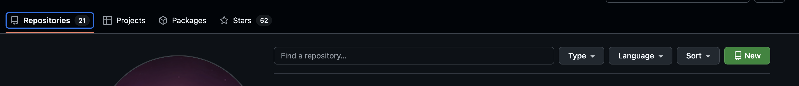
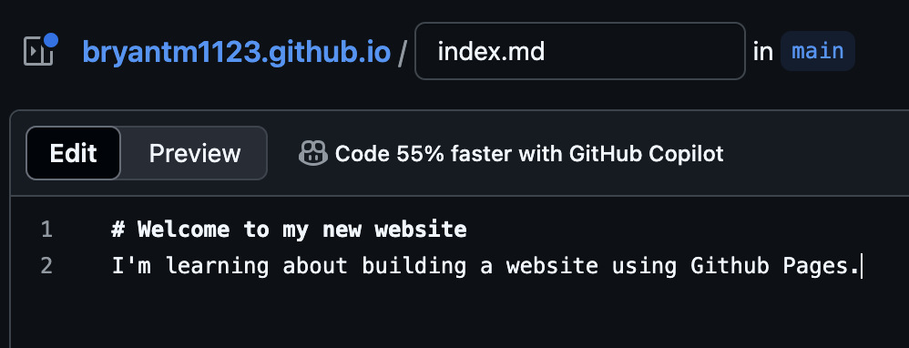
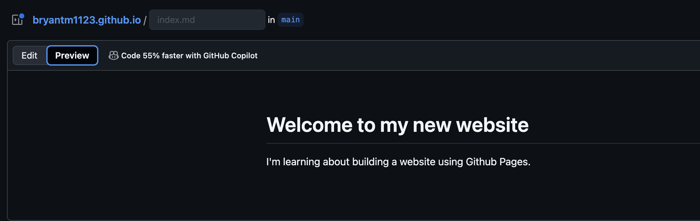
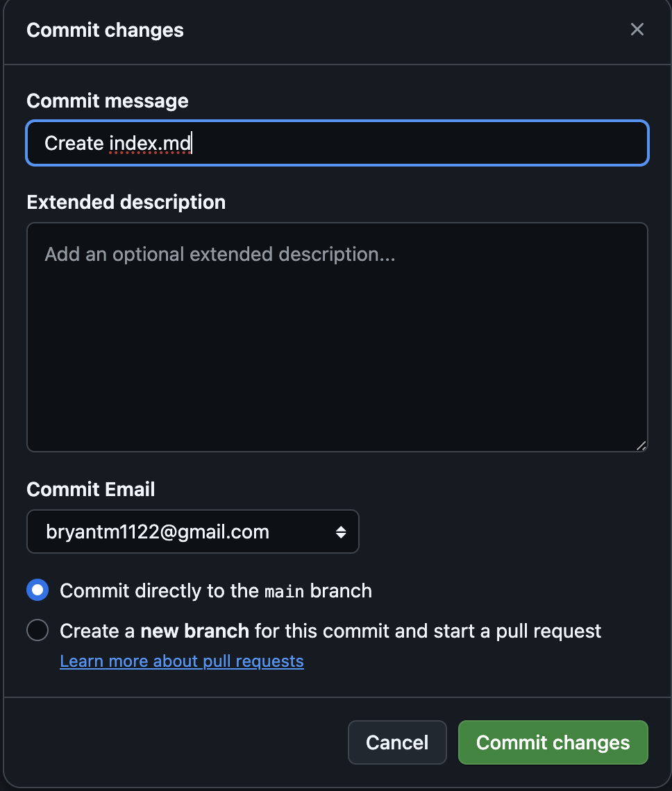

Learn how to create a static website hosted by Github, using a simple repsitory and markdown file.

## Create a Github repository
To get started, you'll need a [Github](https://github.com/) account. A free account will be sufficient for the purposes of this tutorial.

Once you've logged in, click on the *Repositories* tab, then click *New*:

You'll now see a small form for filling in some details about your new repository. In the *Repository name* field, enter `{your Github username}.github.io`. For example, my username is *bryantm1123*, so my repository name would be `bryantm1123.github.io`.

This form also allows you to add a description for your repository, and to mark its visibility on Github as public or private (note: Github Pages are publicly accessible even if your repository is marked private).

We can also add a README file (recommended). README files are traditional in software engineering and typically describe what a project does at a high level, and what setup steps are necessary in order to use it. And they're written in Markdown, which we'll use for the website we're building. So win-win!

## Add an index file
Now that we have a new repository setup, let's add an index file to serve as the landing page for our website. To do this, navigate to your repository and to the *Code* tab. Click *Add file* -> *Create new file*.

Name the file `index.md` and in the editor, add a header and description as shown below:

You can preview what the file will look like when rendered by clicking the *Preview* tab.

Commit your changes by clicking *Commit changes*. It's good practice to write a short commit message which describes what changes you made. We'll also commit this directly to the `main` branch, which is the default source branch for publishing updates to our website.

## Visit your new website
After a few moments, your website should be ready. In the address bar of your browser, navigate to the repository name you created earlier, e.g. `{Your Github username}.github.io`. You should see your shiny new website, open to the landing page powered by the `index.md` file.

## Further reading
To learn more about the Git version control system, visit [https://git-scm.com/](https://git-scm.com/).\
For more about Markdown and how to format `.md` files, see [https://www.markdownguide.org/](https://www.markdownguide.org/)\
And to get the most out of your Github Page, see the official [Github Pages](https://docs.github.com/en/pages) documentation.