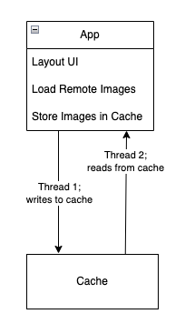

## Introduction
In this tutorial, we'll create a thread-safe, generic cache in Swift and use it as the basis for a custom, asynchronous image loader which will download images from remote hosts and store them temporarily for efficient loading. Before we start building our cache, let's take a moment to understand thread-safety.

## Understanding Thread-Safety
Apps execute tasks like preparing and displaying a user interface, loading data from remote hosts, and reading and writing data to memory by using threads. A thread is a context for executing a series of tasks. Apps can create multiple threads, assigning work to execute in parallel, or *concurrently*. This can sometimes lead to conflicts. Consider the following diagram of an app's multi-threaded approach to accessing its cache:



In this example, the app creates `Thread 1` and assigns it the responsibility of writing new image data to the cache. `Thread 2` is responsible for reading image data from the cache. 

What would happen if `Thread 2` tried to read an image while `Thread 1` is modifying it? The answer is a *data race condition*, which is a fancy way to say "who knows!" 

Data race conditions earn this moniker because the operating system chooses which thread "wins the race" and executes its task successfully, while the other thread is left in uncertainty with an unknown result. This can can cause app instability and unknown side effects, so it's nearly impossible to say with certainty what would happen in the above scenario. Depending on the code implementation, it could lead to the app displaying an incorrect image, or even worse for the user experience, the app could crash.

To prevent data race conditions, we restrict a thread's access to a particular piece of data while another thread is modifying that data, thus making it *thread-safe*. 

Now that we have an understanding of thread-safety, let's take a closer look at some of the key components we'll be using to build our cache.

## Understanding `DispatchQueue`
`DispatchQueue` is a class built on top of the [Grand Central Dispatch (GCD)](https://developer.apple.com/documentation/DISPATCH) system, and used for managing the concurrent (parallel) and serial (one-at-a-time) execution of programming tasks. This enables developers to improve the speed and efficiency of their apps by distributing work across multiple processing threads, and synchronizing the end result.

### Defining a DispatchQueue
A `DispatchQueue` can be initialized with a **label** and **attributes**. 

```
let queue = DispatchQueue(label: "com.example.myqueue")
```
- **Label:** The label is a unique string which can be useful for debugging and identification.

### DispatchQueue Attributes
When creating a `DispatchQueue`, you can specify its attributes:
- **Serial Queue (Default):** Tasks are executed in a *first-in -> first-out* order, one at a time.
    ```
    let queue = DispatchQueue(label: "com.example.serialQueue")
    ```
- **Concurrent Queue:** Tasks are executed in parallel.
    ```
    let queue = DispatchQueue(label: "com.example.concurrentQueue", attributes: .concurrent)
    ```  

### Synchronization Methods
- **Synchronous Execution (`sync`):** The current thread waits until the task completes before continuing.
- **Asynchronous Execution (`async`):** The task runs in the background, and the current thread continues execution.

Example usage:
```
queue.sync {
    print("This code executes synchronously")
}

queue.async {
    print("This code executes asynchronously")
}
```

### Barrier Flags for Exclusive Access
As explained in the section about [thread-safety](#understanding-thread-safety), we need to ensure that we don't allow access to an element in our cache while it is being modified. To do that, we can use the `.barrier` flag on asynchronous operations to guarantee exclusive access to our data during write operations.
```
queue.async(flags: .barrier) {
    print("This task runs exclusively on the queue")
}
```

Now that we've had a brief look at `DispatchQueue`, let's next examine the underlying storage mechanism we'll use for our cache. 


## Understanding NSCache
`NSCache` is a special type of mutable collection that can be used for storing key/value pairs, similar to a [Dictionary](https://docs.swift.org/swift-book/documentation/the-swift-programming-language/collectiontypes#Dictionaries). However, unlike a dictionary, `NSCache` automatically evicts its contents when system memory is low.

### Other Key Features of `NSCache`
- **Thread safety:** `NSCache` is inherently thread-safe for read and write operations. 
- **Cost-based eviction:** You can optionally assign the `cost` of an item when storing it in cache, and a [`totalCostLimit`](https://developer.apple.com/documentation/foundation/nscache/1407672-totalcostlimit). Eviction will start either when system memory resources are low, or when the cache's total cost reaches the `totalCostLimit`.
- **Delegate Support:** `NSCache` provides a [delegate](https://developer.apple.com/documentation/foundation/nscachedelegate) to handle object eviction. The delegate provides a method for taking some action when an object will be evicted from the cache.

## Creating a Thread-Safe, Generic Cache
Building on what we've learned in the previous sections, we'll incorporate `DispatchQueue` and `NSCache` to create our `Cache` class.

```
// 1
class Cache<Key: Hashable & Sendable, Value: Sendable> {
    // 2
    private var cache = NSCache<WrappedKey, WrappedValue>()
    private let queue = DispatchQueue(label: "com.cache.queue", attributes: .concurrent)
    
    // 3
    func getValue(for key: Key) -> Value? {
        queue.sync {
            cache.object(forKey: WrappedKey(key: key))?.value
        }
    }
    
    // 4
    func set(_ value: Value, for key: Key) {
        queue.async(flags: .barrier) { [self] in
            cache.setObject(WrappedValue(value: value), forKey: WrappedKey(key: key))
        }
    }
    
    // 5
    private class WrappedKey: NSObject {
        let key: Key
        
        init(key: Key) {
            self.key = key
        }
        
        override var hash: Int {
            key.hashValue
        }
        
        override func isEqual(_ object: Any?) -> Bool {
            guard let other = object as? WrappedKey else { return false }
            return other.key == key
        }
    }
    
    private class WrappedValue {
        let value: Value
        init(value: Value) {
            self.value = value
        }
    }
}
```

**Step 1:** Declare a class called `Cache` with generic parameters `Key` and `Value`. `Key` conforms to [`Hashable`](https://developer.apple.com/documentation/swift/hashable) so that the underlying storage can identify the correct key during read and write operations. Both `Key` and `Value` conform to [`Sendable`](https://developer.apple.com/documentation/swift/sendable) to ensure thread-safety across concurrent contexts. 

**Step 2:** Create a private instance of `Cache` and a custom dispatch queue with `.concurrent` attribute.

**Step 3:** Provide a method for reading a value from the cache, based on a given key. We use the queue's `.sync` method here because, in general, reading from the cache is a quick operation, and does not modify shared state.

**Step 4**: Provide a method for writing a value to the cache, and assigning it a key. We use the queue's `.async` method with `.barrier` flag because we want to ensure that writes occur sequentially and do not block read operations from proceeding.

**Step 5**: We use a wrapper class for our keys and values to ensure proper key comparison and compatibility with `NSCache`.

## Creating an Async Image Loader
We can now build on top of the generic cache we've just created in the previous section to make a new asynchronous image loader. The image loader will first attempt to read the image from cache, using its URL as the key. If a cached image is not found, the loader will then try to asynchronously fetch the image data from the URL, convert it to an `UIImage` object for display in a user interface, then store the image in the cache.

```
public class AsyncImageLoader {
    // 1
    private let cache = Cache<URL, UIImage>()
    
    public init () {}
    
    // 2
    public func loadImage(from url: URL) async throws -> UIImage {
        // 3
        if let cachedImage = cache.getValue(for: url) {
            return cachedImage
        }
        // 4
        let (data, _) = try await URLSession.shared.data(from: url)
        guard let image = UIImage(data: data) else {
            throw AsyncImageLoaderError.imageConversionError
        }
        // 5
        cache.set(image, for: url)
        // 6
        return image
    }
}

enum AsyncImageLoaderError: Error {
    case imageConversionError
}
```

**Step 1:** Initialize the cache storage using the generic `Cache` class, setting the `Key` type to  `URL`, and `Value` type to `UIImage`.

**Step 2:** Provide an asynchronous method for loading an `UIImage` from a `URL`. This method can also throw an error in case there is a problem retrieving the image. 

**Step 3:** Search the cache for the requested image. If it is found, return it.

**Step 4:** If the image is not found in cache, use the network client's shared session to fetch the image data from its source `URL`. Attempt to convert the returned image data into an `UIImage` type, and throw an error if the conversion fails.

**Step 5:** Write the converted `UIImage` value to cache, using its `URL` as the key.

**Step 6:** Return the image.

## Loading an Image with the Async Image Loader
Now that we've built an asynchronous image loader on top of our cache, let's load an image!

```
// 1
let imageLoader = AsyncImageLoader()

// 2
let url = URL(string: "https://bryantm1123.github.io/_pages/tutorials/swift-stack/pancake-stack.jpeg")!

// 3
Task {
    do {
        // 4
        let image = try await imageLoader.loadImage(from: url)
        print("Image loaded successfully!")
    } catch {
        print("Failed to load image: \(error)")
    }
}
```

**Step 1:** Initialize an instance of the `AsyncImageLoader` we created in the previous section.

**Step 2:** Provide a `URL` object to represent the source location of our desired image.

**Step 3:** Provide a task for calling the asynchronous `loadImage` method.

**Step 4:** Try loading the image. If it loads successfully, print that it has done so, otherwise if an error is thrown, catch and print it.

## Time to Cache In
As we've seen in this tutorial, using the building blocks of `DispatchQueue`, `NSCache`, and Swift Generics, we can create a multi-purpose, thread-safe caching mechanism, that we can then use to build more specific tooling like our async image loader. By understanding and implementing these concepts, we can ensure a better user experience and more efficient app performance.

## Further Reading
For more on `DispatchQueue` see the [official developer documentation](https://developer.apple.com/documentation/dispatch/dispatchqueue).  

For more on `NSCache`, see the [official developer documentation](https://developer.apple.com/documentation/foundation/nscache).

And for tips on how you can detect and diagnose data race conditions, see [Diagnosing memory, thread, and crash issues early](https://developer.apple.com/documentation/xcode/diagnosing-memory-thread-and-crash-issues-early).

To learn more about Swift Generics, see the [official Swift language documentation](https://docs.swift.org/swift-book/documentation/the-swift-programming-language/generics/).  


