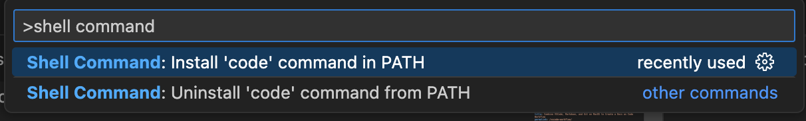
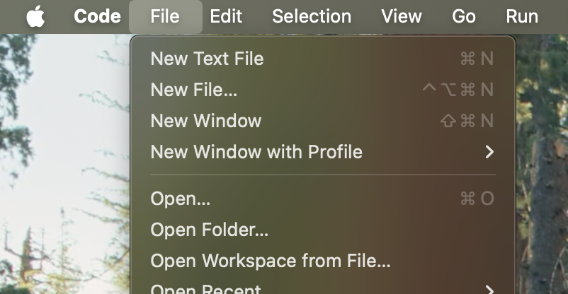
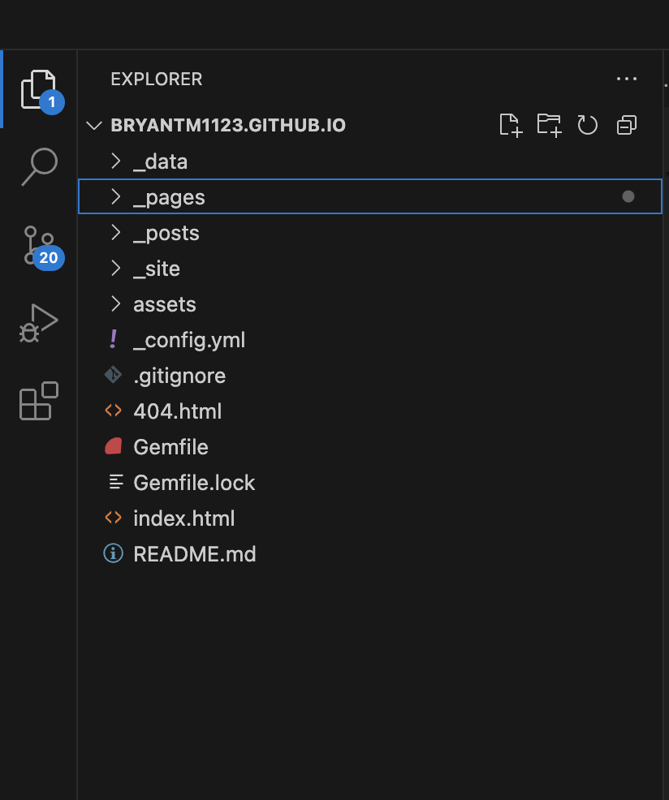
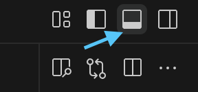
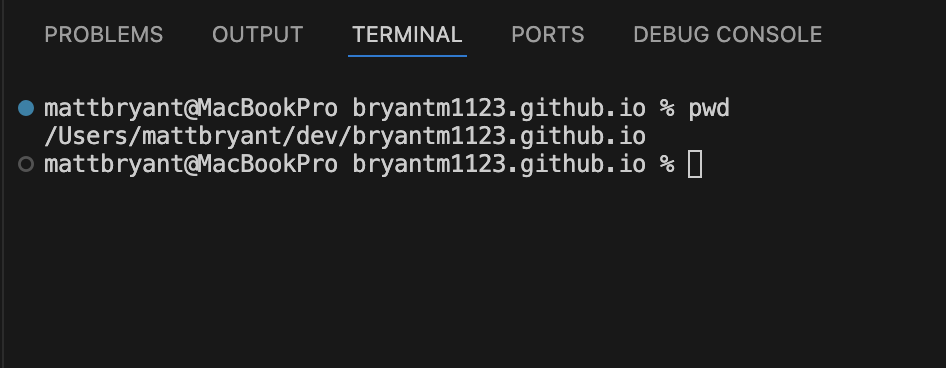
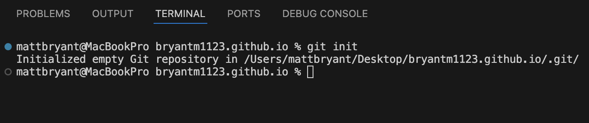
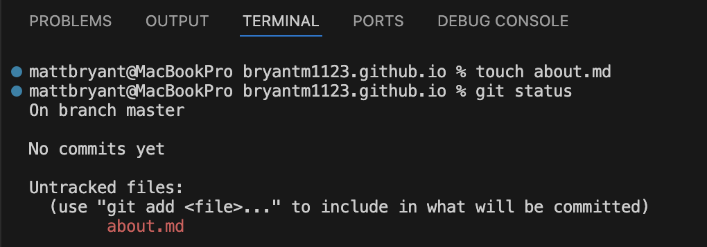
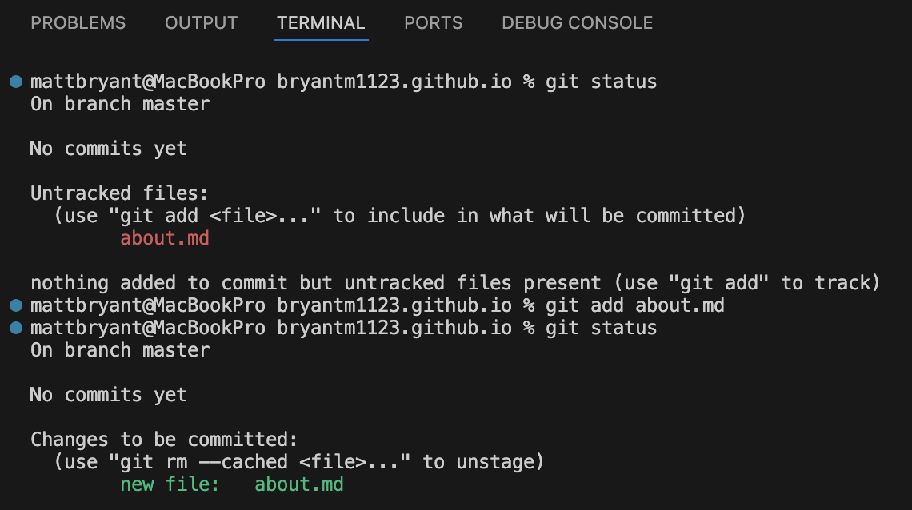
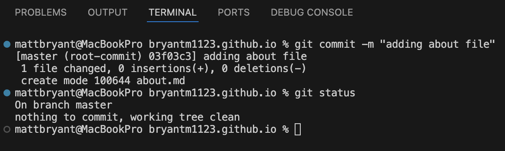
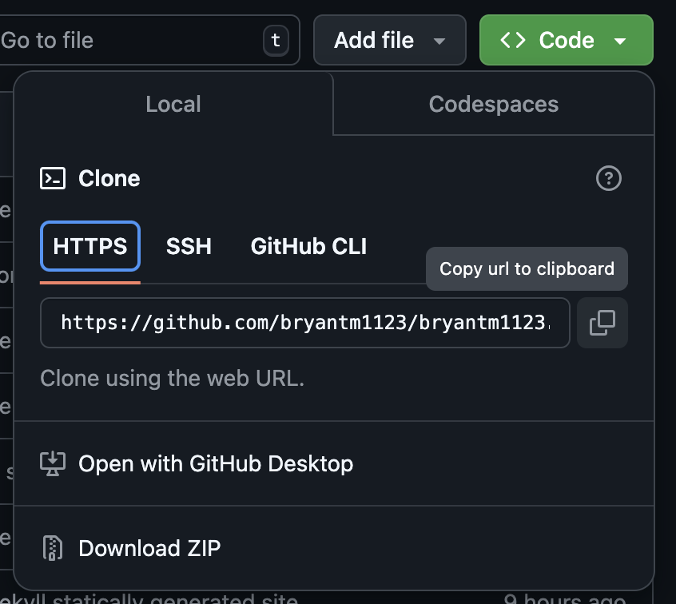

VSCode is a feature-rich, beginner-friendly code editor, which supports Markdown syntax highlighting and a preview window, for previewing how your content will render. Git acts as a record-keeper, allowing you to track and publish your changes, or to roll them back if needed. 

Using Git from VSCode's built-in Terminal Command Line Interface (CLI) window gives you the convenience of editing and publishing your content all in one place.

## Prerequisites
This tutorial assumes working knowledge of Terminal CLI and basic commands. For a primer on Terminal, see [Execute commands and run Tools in Terminal on Mac](https://support.apple.com/guide/terminal/execute-commands-and-run-tools-apdb66b5242-0d18-49fc-9c47-a2498b7c91d5/mac). And for a handy cheat sheet with all the CLI commands you'll need to follow this tutorial, see [Linux Command Line Cheat Sheet](https://www.stationx.net/linux-command-line-cheat-sheet/).

## Install VSCode
Install VSCode for MacOS by following [this setup guide](https://code.visualstudio.com/docs/setup/mac).

Since we'll be working from the command line, I highly recommend the setup step to enable [Launching VSCode from the Command Line](https://code.visualstudio.com/docs/setup/mac#_launch-vs-code-from-the-command-line) This will allow us to open files by simply typing `code filename.md` into Terminal.

## Open Your Project in VSCode
If you followed the [Create a Static Website with Github Pages]() tutorial, you'll already have a project repository with Git enabled, and the ability to publish your content to a live website.

Otherwise, create a new directory at your preferred location in your filesystem. Open VSCode and select *File* -> *Open Folder* and open the directory you just created.

You should now see your project directory open in the Explorer side bar.

Next, access the built-in Terminal window by clicking the *Toggle Panel* button or typing the shortcut `#J`.

Click the *Terminal* tab to display the Terminal window. You should now see the Terminal command prompt. Use the `cd` command to navigate to your directory.

*Hint*: Use the `pwd` command to check that your in the correct directory.

## Initialize a Git Repository
If you're starting from a newly created directory, you'll want to initialize a Git repository. If you're working from your Github Pages respository, you may skip to the [next step](#add-and-commit-your-first-file).

Before using Git to keep track of our files, we must first install it. This can be done from the open Terminal window in VSCode by following [this guide](https://git-scm.com/book/en/v2/Getting-Started-Installing-Git).

To initialize Git, type `git init` in the root folder of your project. You should see an output message saying that your repository has been initialized.

## Add and Commit Your First File
Git keeps track of changes in our files by taking a snapshot of the underlying data at particular points which we specify. This is called a *commit*.

To make our first commit, let's go back to the Terminal window and add a file to our directory by typing `touch about.md`. This will create a new Markdown file called `about.md`

Type `git status`. This will show you the current status of the changes Git is tracking in your directory. 

In the output of the command, you'll see first the `branch` name, in this case the default branch called `master`.  

Next, you'll see `Untracked files` with a list of files that we've newly added (or *staged* in the language of Git). 

We also see a helpful message from Git instructing us to use `git add <file>...` to include the files we want to commit.

Let's add this file now so that we can commit it by using the command that Git suggested to us: `git add about.md`. If you have several files that you want to add at once, type `git add .` to add them all.

If we type `git status` again into Terminal, we should now see an updated output. Instead of `Untracked files:` we should now see `Changes to be committed:` and `about.md` listed in green.

Now we'll commit our new file by typing `git commit -m "adding about file"`. The `-m` flag allows us to add a commit message which contain a brief statement about the changes we made. This can help us or our colleagues to look through the history of commits and understand what changes occured in each commit. 

We now see some statistics from git signifiying what changed. And if we type `git status` again, we can see that we have no current changes to commit.

To see the history of our changes so far, we can type `git log` into the Terminal. This will show the identifier of the latest commit (called a *commit hash*), the author, the date, and the commit message. This metadata about a commit is crucial in rollback procedures. If you commit unwanted changes, you can set the state of your files back to a previous commit by specifying the commit hash.

## Push Commit to Remote Repository
If you followed the tutorial to create a static site with Github Pages, the directory on your local Mac should already have a connection to your remote repository on Github. If not, follow the steps in [Create a Github repository]().
Afterwards, you'll need to create the connection between your local repository on your Mac filesystem and the remote repository on Github. Luckily Git has a command to do just that.

In the Terminal, type `git remote add origin <https url to Github repository>`. You can find the https url for your repository on the *Code* tab in Github. Click the *Code* button and the *HTTPS* tab. Finally click *Copy url to clipboard* and paste the url after `origin` in Terminal and run the command.

In the next step, we'll align our local branch name with the branch on our Github repository so that we push our changes to the correct branch.

`git push --set-upstream origin master`

We only need to do this once (for this branch). For any future commits, we can run simply `git push`.

